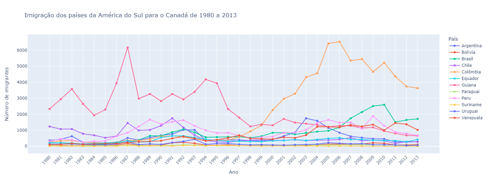

# Projeto de Consultoria para Imigração do Brasil para o Canadá

Este projeto foi desenvolvido com base no curso Data Visualization: criando gráficos com bibliotecas Python da plataforma de cursos Alura. Esse projeto me proporcionou um entendimento aprofundado sobre como otimizar serviços de aconselhamento para brasileiros que desejam imigrar para o Canadá.

## Objetivo do Curso

Ao realizar o curso, consegui:

- Aprender a plotar gráficos e adicionar títulos e rótulos nos eixos.
- Criar figuras com múltiplos gráficos na mesma imagem (subplots).
- Customizar figuras, alterando a posição de títulos, tamanho das fontes, cores e adicionando anotações.
- Salvar visualizações em diversos formatos para uso em relatórios e apresentações.
- Criar gráficos interativos.

Esses conhecimentos são essenciais para aprimorar o processo de consultoria, tornando as análises de dados mais claras e eficazes.

## Funcionalidades Implementadas

Com base nos conhecimentos adquiridos, implementei as seguintes funcionalidades neste projeto:

- Criação de diversos tipos de gráficos utilizando Matplotlib, Seaborn e Plotly.
- Customização avançada de gráficos para melhorar a apresentação dos dados.
- Desenvolvimento de subplots para visualizar múltiplas variáveis em uma única figura.
- Salvamento de visualizações em formatos variados para uso em diferentes contextos.
- Implementação de gráficos interativos para uma análise de dados mais dinâmica.

## Tecnologias Utilizadas

Este projeto foi desenvolvido utilizando as seguintes tecnologias e ferramentas:

- Python
- Matplotlib
- Seaborn
- Plotly

## Resultados

Aqui estão algumas imagens dos gráficos desenvolvidos ao longo do curso:

### Gráfico de Linhas com Matplotlib

### Gráfico de Barras horizontais com Matplotlib

### Gráfico de linha Interativo com Plotly

## Acesso

- Para acessar o Notebook desenvolvido no projeto [clique aqui](Brasil_imigrantes.ipynb).
- Para acessar o certificado do curso [clique aqui](https://drive.google.com/file/d/1jhlxz74PYLLePc0TVTCMOHDx5oxU60up/view?usp=sharing).
